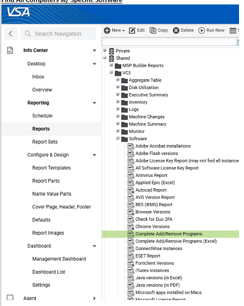
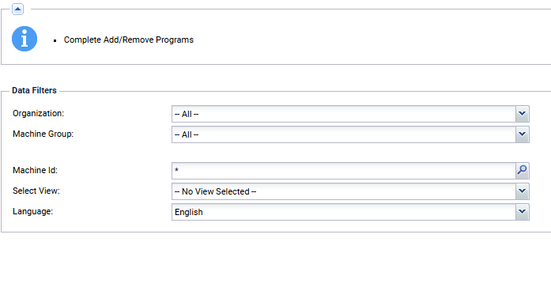

__If you need to see what devices (if any) have a particular application installed, or even all applications in the environment (with what devices have it installed)__

1. Go to "Info Center"
2. Go to "Reporting > Reports"
3. Search for "Complete Add/Remove Programs"
4. At the top, click "Run Now"

   
   
5. You'll get a pop up, apply filters as needed (i.e. Organization would be for filtering devices specific to 1 client, or Machine Id would be for applications on 1 specific device)

   
   
6. Then click "Submit"
7. It'll take a moment, based on what filters you have, but you should end up with another screen showing all the applications.
   **NOTE: This will only look for applications with a .exe file.  It might show an application/tool that is not installed, but the .exe file was not removed**
