📋: Scenario:  TechCorp is opening a new regional branch office.  As the Tier 2 Network Technician, you have been assigned to build out the local network infrastructure from scratch.  The branch requires network segmentation to isolate administrative traffic, employee data, and guest Wi-Fi/devices.

🎯: Required Topology:
* 1x Router: Cisco 2911 (Name: R1-Branch)
* 1x Switch: Cisco Catalyst 2960 (Name: SW1-Core)
* 3x PCs:
  * Admin-PC
  * Staff-PC
  * Guest-PC
* Cabling Connections:
  * Connect R1-Branch to SW1-Core
  * Connect Admin-PC to SW1-Core
  * Connect Staff-PC to SW1-Core
  * Connect Guest-PC to SW1-Core

🌐 VLAN & Subnet Design: Create three distinct VLANs on SW1-Core:
* VLAN 10: Management | Subnet: 192.168.10.0/24
* VLAN 20: Staff | Subnet: 192.168.20.0/24
* VLAN 30: Guest | Subnet: 192.168.30.0/24

Port Assignments: Assign ports accordingly and make sure Trunk Port is on Gi0/1 as an 802.1Q
R1-Branch will act as the DHCP server for VLAN 20 & VLAN 30.

---

## Part 1: Adding the devices
* Add the router, Cisco 2911, and name it R1-Branch
* Add the switch, Cisco Catalyst 2960, and name it SW1-Core
* Add the three end user PC's and name them accordingly: Admin-PC, Staff-PC, and Guest-PC

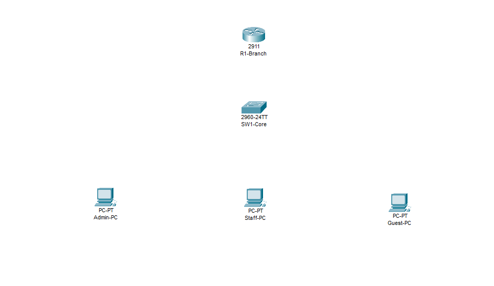

## Part 2: Add the connections
* Using Copper Cross-Over, I connected GigabitEthernet 0/0 on R1-Branch to GigabetEthernet 0/1 on SW1-Core
* Using Copper Cross-Over, I connected FastEthernet 0/1 on SW1-Core to Admin-PC
* Using Copper Cross-Over, I connected FastEthernet 0/2 on SW1-Core to Staff-PC
* Using Copper Cross-Over, I connected FastEthernet 0/3 on SW1-Core to Guest-PC

## Part 3: Setup the Router
* On R1-Branch, using CLI, turned on port GigabitEthernet0/0 using command ``` no shutdown ```
* Ran ``` encapsulation dot1Q 10 ``` (repeat for VLAN 20 and VLAN 30) to enable IEEE 802.1Q VLAN trunking protocol for each protocol
* Ran ``` ip address 192.168.10.1 255.255.255.0``` (repeat for VLAN 20 and VLAN 30) to set the default gateway and subnet maks
* Ran ```ip dhcp excluded-address 192.168.0.1``` and ```ip dhcp pool VLAN10``` under the VLAN 10 Configuration
* Ran ```network 192.168.10.0 255.255.255.0``` and ```default-router 192.168.10.1``` under the VLAN 10 Configuration

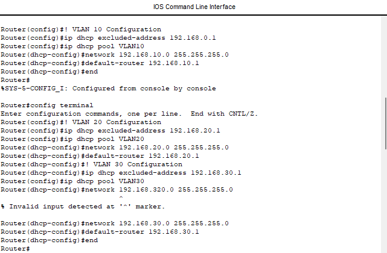

* The two steps above excluded the first IP address (not counting .0) so it can be used later and informed the router that I was setting the DHCP pool for VLAN 10.  Then I set the network and the subnet mask, followed by specifying the default gateway IP as the excluded IP address.
* Repeated all four commands for VLAN 20 and VLAN 30.

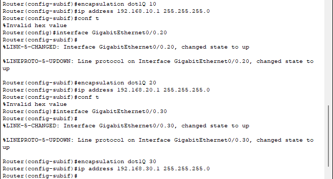

* I checked my running config to confirm my settings to this point

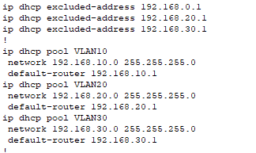

* Ran ```wr mem``` to save the settings as the startup config

## Part 4: Setup the Switch
* Ran ```switchport mode trunk``` on the Gig0/1 port to allow untagged traffic as well as tagged traffic using various tags

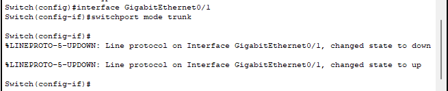

* Ran ``` vlan 10``` and ```name VLAN10``` (repeated for VLAN20 and VLAN30) to establish the three VLANs on the switch

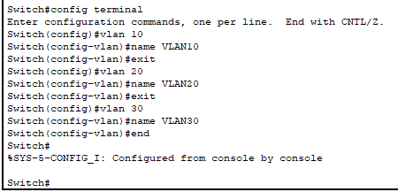

* Ran ```switchport access VLAN 10``` on interface fa0/1 to allow VLAN10 traffic to pass on that port
* Ran ```switchport access VLAN 20``` on interface fa0/2 to allow VLAN20 traffic to pass on that port
* Ran ```switchport access VLAN 30``` on interface fa0/3 to allow VLAN30 traffic to pass on that port

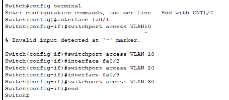

* Checked my running config and saved to startup config

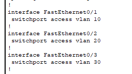

## Part 5: Check work and troubleshoot
* Started the simulation and found that my packets were dropped at the workstations
* Checked my workstations and found they were all set to static IP (that had not been declared)
* Changed all three devices to be set to automatic IP assignment
* Opened Command Prompt ran ```ipconfig /all``` and confirmed the computers have IP addresses

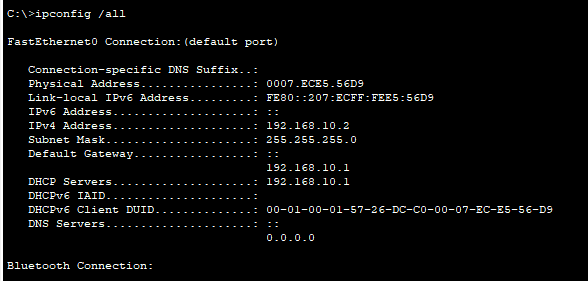
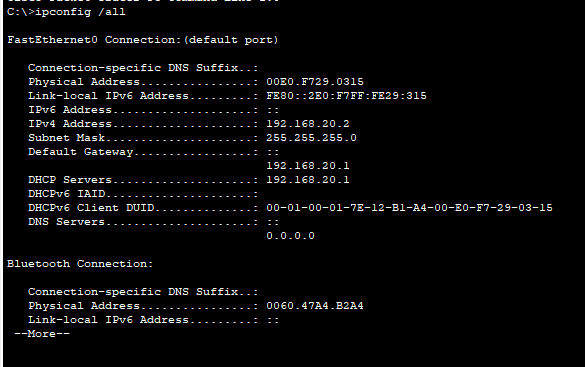

* Tried to ping Staff-PC on VLAN20 from Admin-PC on VLAN10, but realized that I do not have a DNS server
* Pinged Staff-PC via 192.168.20.2 and it was successful

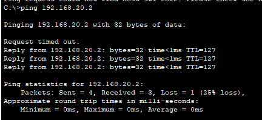

* Ran the simulation again and the packets failed.  For full transparency here, I was not filtering my simulation packets, so I was seeing ALL traffic.  Once I filtered for only ICMP traffic, I could see my successful traffic.


## Cisco Packet Tracer Lab
[Cisco Packet Tracer Pkt](../assets/projects/inter-vlan-routing)
